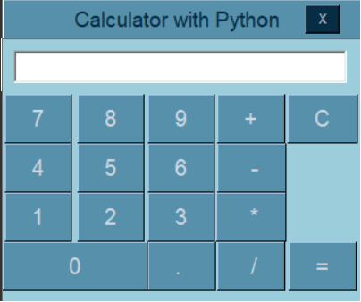

# PROJECT : CALCULATOR

## LANGUAGE : Python

### LIBRARIES : Tkinter - GUI / Pyinstaller

   [Tkinter](https://docs.python.org/3/library/tkinter.html#module-tkinter) Docs

   [Pyintaller](https://pyinstaller.org/en/stable/) Docs

## DESCRIPTION : 

Basic calculator developed in Python with use of Tkinter library, functionality for add, substract, multiply and divide two numbers.
Customize title bar, move of window managed with a function.
Styled with helvetic font, and colors picked in blue scale.
As part of the feedback to the user it not just print the click number in the 'screen' but the button that is click has a change in the color, it goes when released.
Python file converted to executable with Pyinstaller by CMD.

If want to download the exe file of the first release click [here](https://drive.google.com/file/d/1EHQbT14v4eo0uyrJFfrGNebb_-sC2BEB/view?usp=sharing)

The file is being storage in Google Drive, and being exe it flags risk but it is a copy of the one in this repo.

## TO IMPLEMENT IN FUTURE (18/01/24)

- Manage of errors when goes over two numbers, and the feedback to the user on this. 
    **19/01/24**  ERROR message print in e when the entry is empty.
- Extend the limit of parameters (numbers) it can process.  
    **19/01/24**  The result (=) can be use as parameter for a next process if selecting an operator. 
    **BUG to fix:**  Digits can be add to the result. 
- Use of 'list' to storage the process.
- Refactor the operators code.

## CREDITS:

For this app I had been inspired by Python communities in Facebook, where seen others people results and some snippets, what give me idea of what library read into. Also seen the Codemy tutorial on it. Finally video on the use of Pyinstaller and its documentation.
    
   [Codemy tutorial here](https://www.youtube.com/watch?v=s0cpxPSN4k4)

   [Code First with Hala - Pyinstaller](https://www.youtube.com/watch?app=desktop&v=Iv_dECet_oM)